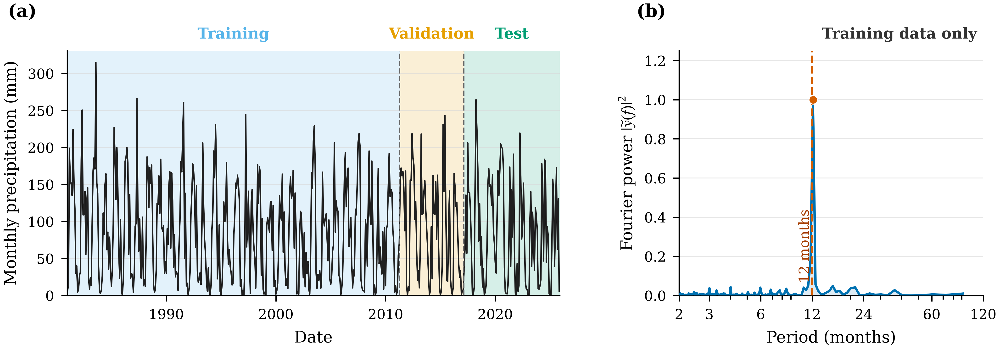
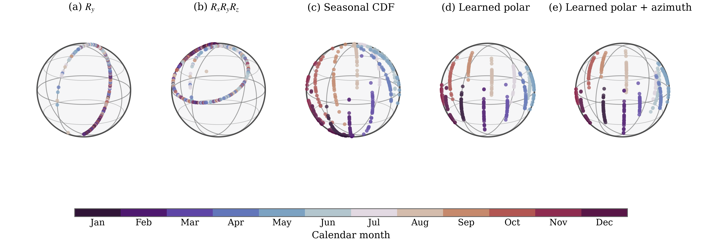
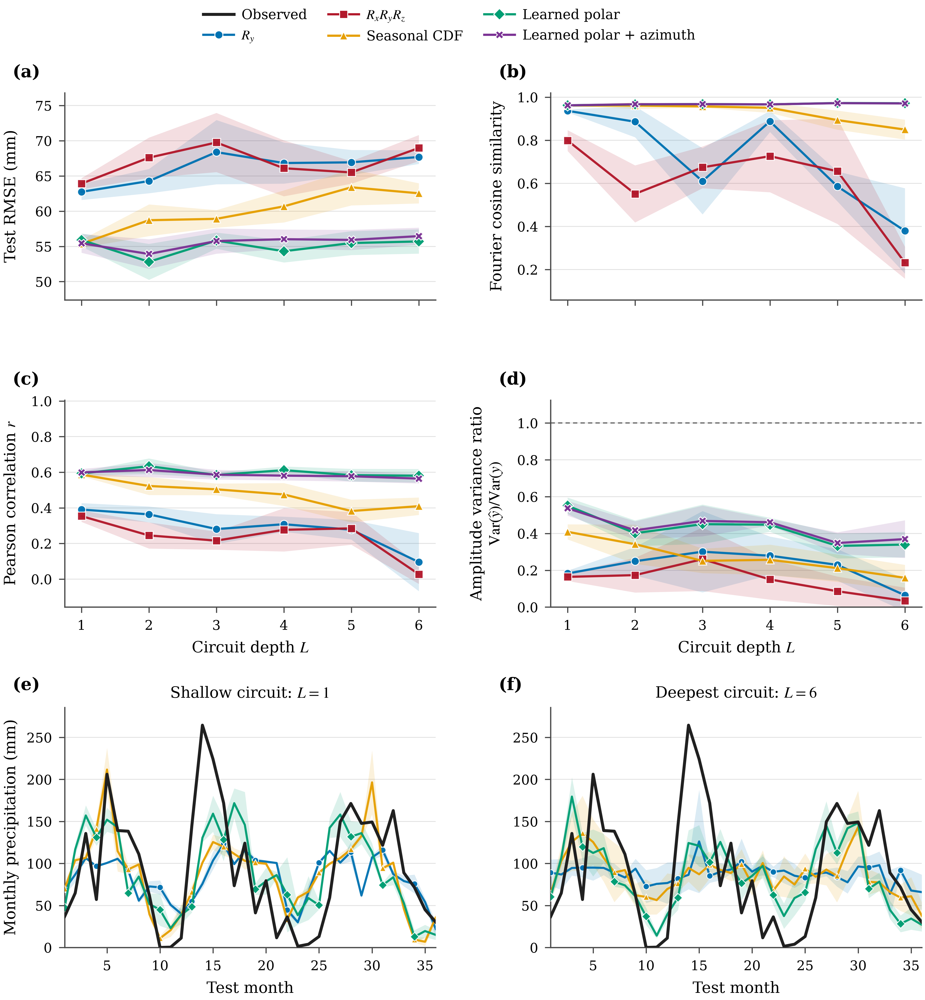

# Quantum Learning for Geospatial Time Series: Seasonal Encoding and Noise-Aware Algorithms

**A 14-qubit quantum-neural-network study of seasonal geospatial forecasting, data-encoding geometry, circuit-depth degradation, and realistic device noise.**

> **Project status:** The complete ideal study—150 independently trained QNNs—is available in this repository. Topology-aware noisy simulations using a frozen IBM Aachen backend snapshot are currently running in production on HPC. The associated manuscript is in preparation.

## Project at a glance

| Component             | Configuration                                                          |
| --------------------- | ---------------------------------------------------------------------- |
| Forecasting task      | Monthly precipitation, one-step-ahead prediction                       |
| Input                 | 14-month lag window                                                    |
| Quantum model         | 14-qubit data-reuploading QNN                                          |
| Encodings             | Five value-based and season-aware quantum encodings                    |
| Circuit depths        | 1–6 reuploading layers                                                 |
| Ideal experiments     | 5 encodings × 6 depths × 5 seeds = 150 runs                            |
| Ideal simulator       | PennyLane `default.qubit` state-vector simulator                       |
| Canonical noisy study | Finite-shot, topology-aware IBM Fake Aachen simulations                    |
| Noisy optimization    | SPSA followed by Adam refinement                                       |
| Execution platform    | Slurm-based HPC arrays and parallel worker pools                       |
| Current status        | Ideal study complete; noisy production runs and manuscript in progress |

## Technical stack

* **Quantum machine learning:** PennyLane, Qiskit, Qiskit Aer, data reuploading, variational quantum circuits
* **Classical learning:** PyTorch, hybrid quantum-classical optimization, Adam
* **Noisy optimization:** SPSA-to-Adam two-pass training
* **Quantum simulation:** ideal state-vector and finite-shot hardware-informed simulation
* **Device-aware compilation:** native basis gates, coupling maps, fixed qubit layouts, and topology-aware transpilation
* **Scientific computing:** NumPy, pandas, SciPy, Matplotlib
* **Analysis:** Fourier spectra, temporal fidelity, Bloch-sphere geometry, correlation, and quantum-geometric diagnostics
* **High-performance computing:** Slurm job arrays, parallel worker pools, checkpointing, and reproducible environment snapshots

## Model architecture

Each training example maps a sequence of 14 monthly precipitation observations to the immediately following month. One lag value is assigned to each qubit.

Within every reuploading layer, the circuit applies:

1. a selected quantum data encoding;
2. trainable single-qubit rotations;
3. a ring of nearest-neighbor CNOT gates.

After the final layer, the 14 local Pauli-\(Z\) expectation values are passed to a small PyTorch linear–tanh head that produces the next-month forecast.

<p align="center">
  <a href="results/figures/figure00_qnn_architecture.pdf">
    
  </a>
</p>

<p align="center">
  <em>Hybrid forecasting architecture, expanded reuploading layer, and five encoding choices. Click the figure to open the publication-quality PDF.</em>
</p>

## Research question

Regular angle encoding methods for embedding classical data into quantum circuits results in a degradation of the predictive and seasonal fourier structure with depth.

This project asks:

> **Can season-aware quantum encodings preserve the recurring structure of a geospatial time series as data-reuploading circuits become deeper?**

To test this, the variational ansatz, measurement strategy, forecasting windows, dataset splits, and classical output head are held fixed while the data encoding and reuploading depth are varied.

## Dataset and seasonal structure

The study uses 539 monthly precipitation observations from Napak, Uganda, covering January 1981 through November 2025. A 14-month sliding window produces 525 one-step forecasting examples.

The examples are partitioned chronologically, without shuffling:

* **Training:** 350 targets, March 1982–April 2011
* **Validation:** 70 targets, May 2011–February 2017
* **Test:** 105 targets, March 2017–November 2025

All data-dependent transformations are fitted using the training interval only. The training spectrum has a dominant period of approximately **12.13 months**, providing a direct empirical motivation for incorporating calendar phase into the quantum representation.

<p align="center">
  
</p>

<p align="center">
  <em><strong>Dataset and seasonal structure.</strong> The precipitation series is divided chronologically into training, validation, and test intervals. Its training-only Fourier spectrum displays a strong annual component near 12 months.</em>
</p>

## Five quantum data encodings

The experiments compare five encoding families while keeping the rest of the forecasting architecture unchanged.

1. **Standard \(R_y\)**
   Maps each scaled precipitation value to a rotation about one axis. This is a value-only encoding with no explicit calendar information.

2. **Same-scalar \(R_xR_yR_z\)**
   Applies the same data-dependent scalar about all three rotation axes. Although geometrically more intricate, it remains a value-only encoding.

3. **Fixed seasonal CDF**
   Maps the empirical training-data cumulative distribution to the polar angle and the calendar month to the azimuthal angle.

4. **Learned-polar seasonal CDF**
   Begins from the fixed seasonal construction and learns month- and layer-dependent deformations of the polar coordinate.

5. **Learned-polar-plus-azimuth seasonal CDF**
   Additionally learns bounded, month-dependent shifts of the seasonal azimuth.

<p align="center">
  
</p>

<p align="center">
  <em><strong>Encoding geometry.</strong> Value-only encodings organize states primarily by precipitation magnitude. Seasonal encodings place magnitude and calendar phase on separate Bloch-sphere coordinates, while the adaptive variants learn controlled deformations of that geometry.</em>
</p>

## Main ideal-simulation results

Every encoding was evaluated at depths \(L=1,\ldots,6\) using five independent random seeds. Model selection used validation loss only, and each retained checkpoint was evaluated once on the held-out test interval.

Performance is summarized using four complementary metrics:

* **Test RMSE:** absolute forecasting error; lower is better.
* **Fourier cosine similarity:** agreement between predicted and observed spectral content; higher is better.
* **Pearson correlation:** agreement in temporal variation; higher is better.
* **Amplitude variance ratio:** predicted variance divided by observed variance; values closer to one indicate better recovery of signal amplitude.

<p align="center">
  
</p>

<p align="center">
  <em><strong>Ideal forecasting performance.</strong> Panels (a–d) compare the five encodings across reuploading depth. Panels (e–f) show representative forecasts for the first 36 test months at depths 1 and 6.</em>
</p>

### Key findings

* **Seasonal structure is visible before modeling.** The training data contain a dominant approximately annual frequency, making calendar phase a physically meaningful input rather than an arbitrary additional feature.

* **Value-only encodings degrade with depth.** The \(R_y\) and same-scalar \(R_xR_yR_z\) models lose spectral similarity and temporal correlation as the number of reuploading layers increases.

* **Season-aware encodings are more depth-robust.** The fixed and learnable seasonal encodings retain substantially stronger forecasting and spectral behavior across depths 1–6.

* **The learned-polar model produces the lowest mean test RMSE.** Its best result occurs at depth 2, with a five-seed mean test RMSE of approximately **52.81 mm**.

* **Seasonal models preserve spectral structure particularly well.** The adaptive seasonal encodings maintain Fourier cosine similarities of approximately **0.96–0.97** throughout the depth sweep, while the value-only encodings deteriorate substantially at larger depths.

* **Additional flexibility is not automatically beneficial.** Allowing the seasonal azimuth to adapt does not consistently improve upon learning the polar transformation alone.


## Noise-aware quantum simulation

The repository contains two distinct noisy-simulation workflows.

### Fake Melbourne development platform

[`data_reupload/noisy_direct14/`](data_reupload/noisy_direct14/) contains the preliminary **FakeMelbourneV2** finite-shot testing platform.

It is used to:

* test noisy training and aggregation code;
* validate finite-shot execution;
* develop the SPSA-to-Adam optimization workflow; and
* perform smoke tests before launching larger HPC experiments.

This platform applies a hardware-derived noise model but does **not** enforce the final device topology. The directory name `noisy_direct14/` is retained to preserve existing experiment paths.

### Canonical Fake Aachen simulations

[`data_reupload/noisy_aachen/`](data_reupload/noisy_aachen/) contains **the canonical noisy simulations for the manuscript**.

These runs use:

* a frozen Aachen calibration snapshot;
* finite-shot Qiskit Aer simulation;
* the device’s native basis gates and coupling map;
* a fixed physical-qubit layout;
* topology-aware transpilation; and
* two-pass SPSA-to-Adam training.

The Aachen runs are currently executing in production through Slurm-based HPC workflows. Noisy results will be added to the tables only after each required experiment block is complete and its validation checks pass. This avoids presenting incomplete seed or depth comparisons.

## Study overview

The forecasting models operate directly on 14-step input windows using 14-qubit data-reuploading circuits. The repository contains five encoding families:

* `RY` baseline encoding
* same-scalar `RX-RY-RZ` encoding
* fixed seasonal-meridian encoding
* learnable seasonal-CDF encoding
* learnable seasonal-CDF encoding with an additional `RZ` component

The experimental workflow includes:

* ideal state-vector simulations across circuit depths 1–6 and five random seeds;
* topology-aware finite-shot noisy simulations using a frozen Aachen backend snapshot;
* a preliminary FakeMelbourneV2 noise-model testing platform;
* two-pass SPSA-to-Adam noisy-training workflows;
* exact temporal-fidelity, spectral, and quantum-geometric analyses;
* validation and aggregation scripts for the manuscript tables; and
* portable Slurm entry points for HPC reproduction.

The curated ideal study contains 150 completed runs. The Aachen simulations constitute the canonical noisy study and are currently in production. Their results will be added after the corresponding experiment blocks and validation checks are complete.

## Repository layout

```text
.
├── data/
│   ├── raw/                         # study CSV and provenance notes
│   └── processed/                   # preprocessing configuration and metadata
├── data_reupload/
│   ├── scripts/final_sweep/         # canonical ideal QNN training programs
│   ├── noisy_direct14/              # FakeMelbourneV2 development platform
│   ├── noisy_aachen/                # canonical Aachen noisy simulations
│   ├── analysis/                    # forecasting, geometry, and validation analyses
│   ├── report/                      # manuscript-asset generation
│   └── slurm/                       # ideal and analysis Slurm entry points
├── docs/                            # data and reproduction guides
├── results/
│   ├── tables/ideal/                # curated machine-readable ideal results
│   └── figures/                     # publication-facing figures
├── scripts/                         # dataset-preparation utilities
└── legacy/                          # archived pre-paper experiments
```

The active paper implementation is at the repository root. Earlier LSTM-autoencoder and exploratory hybrid-QNN work is preserved under [`legacy/`](legacy/) for historical context and is not part of the canonical paper workflow.

The `noisy_direct14/` name is retained to preserve existing experiment paths. It contains the preliminary FakeMelbourneV2 testing workflow, which applies a hardware-derived noise model and finite-shot sampling without enforcing the device coupling map. The manuscript’s canonical noisy simulations are under `noisy_aachen/`; they use the frozen Aachen calibration snapshot, native basis gates, coupling map, fixed physical-qubit layout, and topology-aware transpilation.

## Data

The included study file is:

```text
data/raw/SPEI_AllScales_Napak - SPEI_AllScales_Napak.csv
```

The experiments use the monthly `precip_mm` series, chronological training/validation/test splitting, and input windows of length 14. Dataset provenance, integrity information, preprocessing rules, and split metadata are documented in:

* [`data/raw/README.md`](data/raw/README.md)
* [`docs/data.md`](docs/data.md)
* [`data/processed/precip_mm_windowed_supervised/`](data/processed/precip_mm_windowed_supervised/)

The dataset is included with permission from the contributing coauthor. It is not covered by the repository’s MIT software license; see [`NOTICE.md`](NOTICE.md).

## Reproducing the work

Start with [`docs/reproducibility.md`](docs/reproducibility.md). It describes three levels of execution:

1. environment and import checks;
2. representative ideal and FakeMelbourneV2 noisy smoke runs; and
3. full HPC reproduction through the supplied Slurm jobs.

The mapping from each experiment family to its training code, scheduler entry point, analysis workflow, and curated outputs is provided in [`docs/experiment-map.md`](docs/experiment-map.md).

Environment specifications include:

* [`requirements_hpc.txt`](requirements_hpc.txt) for the ideal and HPC workflows;
* [`data_reupload/noisy_direct14/scripts/requirements_noisy_qml_core.txt`](data_reupload/noisy_direct14/scripts/requirements_noisy_qml_core.txt) for the FakeMelbourneV2 development platform; and
* exact environment snapshots under [`data_reupload/noisy_aachen/environment/`](data_reupload/noisy_aachen/environment/) for the canonical Aachen simulations.

All maintained Python and Slurm workflows resolve the repository through `QML_PROJECT_ROOT` when it is set and otherwise infer the root from the script location. This avoids dependence on a particular user’s cluster path.

## Results

Curated ideal result tables are stored under [`results/tables/ideal/`](results/tables/ideal/), organized into forecasting, geometry, validation, and encoding-specific diagnostic outputs.

The repository intentionally excludes raw checkpoints, large prediction arrays, scheduler logs, caches, and smoke-test outputs. Canonical Aachen result tables will be added after the production runs and validation workflow are complete.

See [`results/README.md`](results/README.md) for the publication-results policy.

## Authors and contributions

Software implementation and repository maintenance:

* **Devjyoti Tripathy** — Department of Physics and Quantum Science Institute, University of Maryland, Baltimore County

Associated manuscript authors:

* Devjyoti Tripathy
* Reece Robertson
* Josey Stevens
* Catherine Lilian Nakalembe
* Sebastian Deffner

The manuscript author list reflects the broader scientific collaboration. The software authorship metadata in [`CITATION.cff`](CITATION.cff) identifies Devjyoti Tripathy as the sole implementation contributor to this repository.

## Manuscript and citation

The associated manuscript is currently in preparation. Its arXiv identifier, journal information, and final citation will be added when available.

If you use this software or build upon the experimental workflows, please cite the repository using [`CITATION.cff`](CITATION.cff). The manuscript is currently represented there as an unpublished work in preparation.

## License

Original code and documentation in this repository are released under the [MIT License](LICENSE). The study dataset, third-party dependencies, backend snapshot, and associated manuscript are subject to the separate terms described in [`NOTICE.md`](NOTICE.md).
